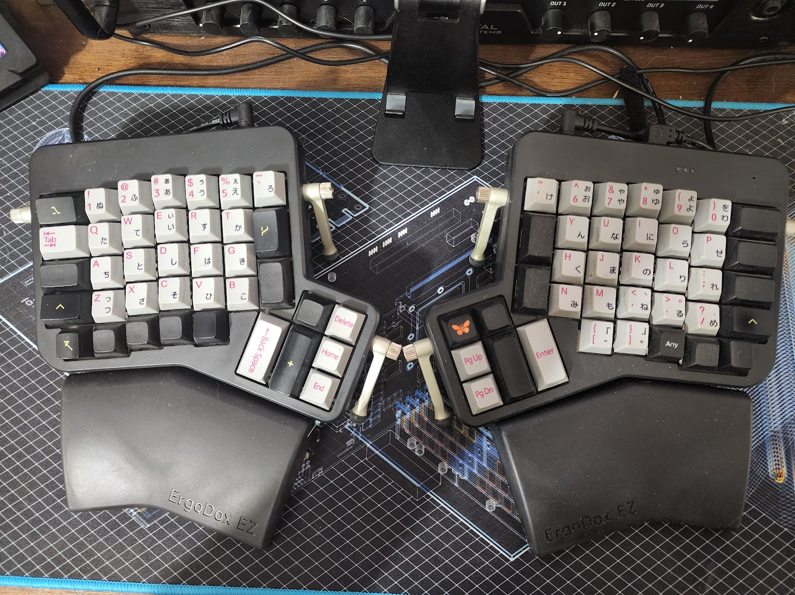

# My Ergodox

> 🛈 Information
> 
> This is an old post that I wrote for a previous blog.
> It's here mainly just so I could test Hugo stuff.
> I do not use this as my main keyboard anymore, a blog post about my new keyboard is on the works.

For a number of years now (I started maybe in 2017) I have been using an ergonomic split keyboard of open source design, the [Ergodox](https://www.ergodox.io/). You can either build it yourself from scratch, build it from parts or buy a completed working keyboard from a company or an independent builder. I have two, an [Infinity](https://drop.com/buy/infinity-ergodox) and an [Ergodox-EZ](https://ergodox-ez.com/).



While the ergonomics and coolness factor of it being split (thats the reason I got it in the first place!) are pretty nifty, the best feature by a longo shot is that it is completely customizable, mine uses the open source firmware [QMK](https://qmk.fm/), I'm not going to talk too much about what QMK is or how to use use it, you just need to know its a very configurable firmware for keyboards that is coded in C, and its compatible with a huge number of [different keyboards](https://qmk.fm/keyboards/).

I've been feeling really good using it and it was easy to adapt to the layout, altought I still don't find a good spot to place the right half, my right hand never hurts but its not very confortable either, I still have to find the perfect spot for it.

## My layout

My custom layout is not very adventurous, its mostly just normal Qwerty, with a couple modifications to make it more streamlined to what I do in my day to day. You can see it here: [online configurator](https://configure.zsa.io/ergodox-ez/layouts/RWOE5/latest/1).

I used to edit the code by hand and compile it myself, but I recently found out the online configurator has gotten much better than it was and now it mostly satiesfies my needs.

Its still a work in progress, buts lets take as quick look:

### Layer 0



Not much to see here. Just a basic QWERTY layout. I have buttons to change layers momentarily in the right thumb cluster. I also have two spaces, one on each side. I am still playing with this layout so many of the keys are close to the default and they don't actually get used by me yet.

### Layer 1



This is mainly a layer for some functions. Do not pay attention to the symbols on the left side, I do not use them and they are there as leftovers from the default layout.  
I decided to take the keys that are normally WASD and make them the arrow keys, this makes for a easy seamless navigation (specially for games). The macros are just shortcuts to copy and paste (they are located where the C and V keys normally are), as well as easy access to Ctrl+Alt+Del (located on the bigger key at the rightmost corner), and also a shortcut to bring up Ditto (my clipboard manager in Windows). Pretty handy.  
On the right half there is a numpad, but I rarely use it. In fact I forgot it was there until I wrote this!

### Layer 2



Pretty simple too. I replace WASD with keys to move my mouse pointer around; and the Q and E keys become left and right click respectively. I also set up some keys here to control the volume and media that is playing. Everything else is still the default for now.

## What I want to do

I want to play around more and come up with new exciting things to do and change.  
For one, I want to learn a new layout. Dvorak maybe? Or something else, I've always been intrigued by these alternative layouts but always been to lazy to actually commit and make the change. Maybe now I will be able to do it if I have it in a separate quick to access layer...
